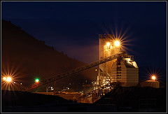

Not sure exactly what this building is. It looks like some kind of quarry elevator thing.

I've had my eye on it for a while, the lighting works quite well when it's dark out, but it was hard to find a good position to get in for the shot. It's gated pretty much all the way around. Fortunately I found a little gap between a couple of trees on a nearby street. It's a good thing God created telephoto lenses.

 <a href="http://www.flickr.com/photos/swilliams/212231281/">Night Factory</a>
 
Originally uploaded by <a href="http://www.flickr.com/people/swilliams/">Krazy Yak</a>.

