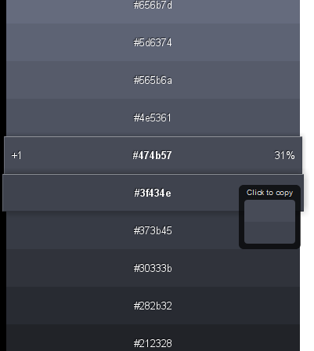

Found this site via <a href="http://www.smashingmagazine.com/2010/06/28/50-powerful-time-savers-for-web-designers/">Smashing Magazine</a>:

> 
<a href="http://0to255.com/">0 to 255</a>

"a simple tool that helps web designers find variations of any color."

> And speaking of Smashing Magazine, I tend to like what they do, but I often find it's almost like drinking from the firehose. They offer so much aggregated content, I often just skip their articles altogether since it would be too much effort for me to sift through them all.