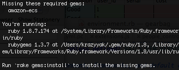

I was trying to get my rails app to properly search amazon, using the <a href="http://github.com/jugend/amazon-ecs/">amazon-ecs</a> library, but could never get the local server to start up. Turns out the problem was in my environment.rb file. I had entered:

```ruby
config.gem "amazon-ecs"
```

The error I was getting was a big stack trace that ended with:

I was approaching the point of screaming back, "I ALREADY RAN THE INSTALL YOU STUPID MACHINE!" However, it turns out you also need to specify the library too:

```ruby
config.gem "amazon-ecs", :lib =&gt; "amazon/ecs"
```