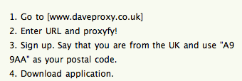

I've been waiting for <a href="http://www.spotify.com">Spotify</a> to come to the US for what feels like ages, especially since Apple killed off <a href="http://Lala.com">Lala.com</a> (jerks). I suppose I shouldn't complain too much since we still have <a href="http://www.hulu.com">Hulu</a>, which is still US only.

And then I saw this on <a href="http://lifehacker.com/5330148/spotify-is-the-best-desktop-music-player-weve-ever-used">LifeHacker</a> today:

The downloaded app does <em>not</em> check your IP... Not saying whether it's 100% legal or not, just reporting the news.

Oh, and there is an Android client for it too. Consider my week made.