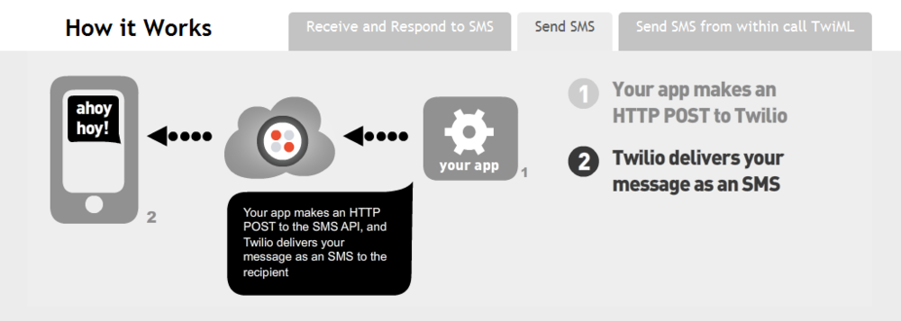

I will likely be using <a href="http://www.twilio.com/">Twilio</a> for SMS integration in future projects. What really sold me was this <a href="http://www.twilio.com/sms/">infographic</a> that they used to demonstrate how easy it is to programmatically send an SMS. Interestingly though, they didn't appear when I did a Google search for how to programmatically send a text message.