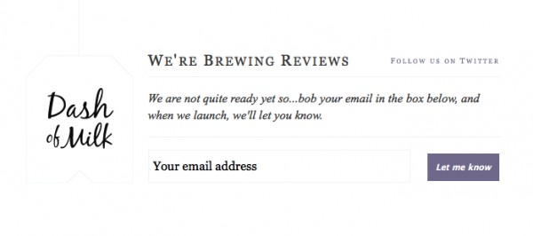

Via <a href="http://emberapp.com/explore/categories/web-design/sign-up-forms/prmack:email-signup-dashofmilk">ember</a>. The de factor way of doing things is usually vertical. Logo, above a text blurb, above a form. I like how this is more horizontal.