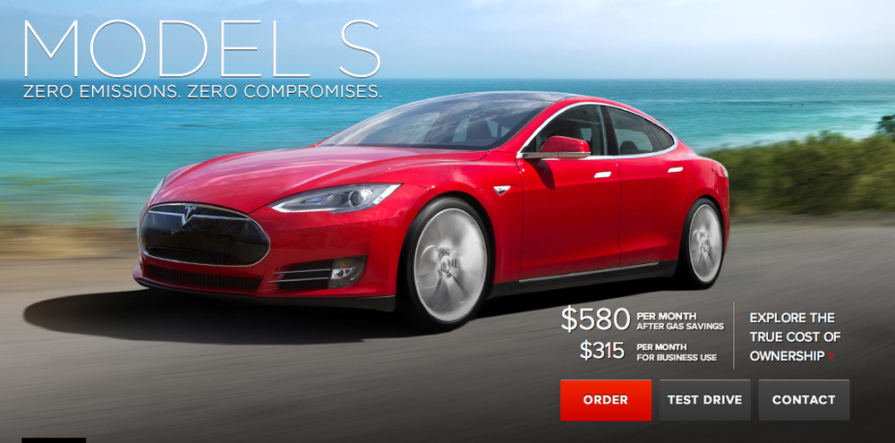

I tend to yo-yo on my feelings with Tesla motors. This video <a href="http://www.wired.com/autopia/2013/07/tesla-plant-video/">(and article)</a> of the Tesla plant hits all the right spots in my nerd brain: technology, robots, nice cars. And it passed the 5 year old test ("Can we watch it again Daddy?") too. 

I like Tesla cars quite a bit. If I had a spare $60-70k to burn on a car, I just might get a Model S.

Which is why I find it particularly frustrating when they pull marketing like this.

"$580 per month"?

That $580 isn't as low as it once was, but the snake oil in that ad has already been covered by <a href="http://blogs.wsj.com/corporate-intelligence/2013/04/02/the-strange-maths-of-teslas-500month-model-s/">plenty of others</a>. If you need a 3 line asterisk to describe the "true cost of ownership" of your product, your message might be a little muddled. The cars could <a href="http://www.motortrend.com/oftheyear/car/1301_2013_motor_trend_car_of_the_year_tesla_model_s/viewall.html">practically market themselves</a>, but the leadership of the company seems to think it's not enough and stoops to this level.

These things seem at odds with each other, but I think there is a line to walk. I can like the cars/engineering/tech for what they are, and try to close my eyes when their marketing goes bananas. It's not like I have a vote in the situation, democratically or dollar-wise, anyway. (Plus, rooting for brands is just dumb.)