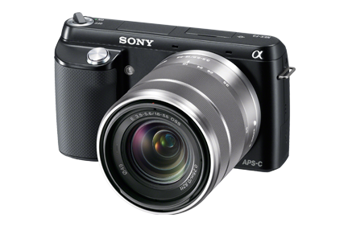

I have three digital <a href="http://en.wikipedia.org/wiki/Single-lens_reflex_camera">SLR</a> cameras1, and a bunch of nice lenses to go with them. I've been an <a href="http://swilliamsphoto.com">amateur photographer</a>, and have taken tens of thousands (if not more) photos of weddings, portraits, and landscapes over the years. I love my photography gear, and even though I don't use it quite as much as I used to, I'm not going to be changing it any time soon.

But, with a few exceptions, I don't think anyone should buy a DSLR anymore.

DSLRs are big. Like, Orca big. Newer models have been hitting the <a href="http://www.youtube.com/watch?v=zXqOZ1JkFFE">Slim-Fast</a>, but you are never going to be able to fit one in a pocket or purse any time soon. This means you will need a dedicated bag or backpack, which means you won't be taking it with you, ever. Part of the reason smartphones have replaced point &amp; shoots is that you always have it with you.

DSLRs are like gym memberships. People pay lots of money for them, use them for about a month, and then never again.

Instead, if you really want to drop several hundred dollars on a camera, get a small <a href="http://en.wikipedia.org/wiki/Mirrorless_interchangeable-lens_camera">mirrorless</a>. They're a little bit cheaper, will give you the same quality, and are <strong>much</strong> smaller. If I were starting over today, I'd get one. <a href="http://zackarias.com/for-photographers/gear-gadgets/fuji-x100s-follow-up-review-life-without-dslrs/">Even some pros are using them for day to day work.</a>.

<figure>
    
    <figcaption>The Sony NEX-F2</figcaption>
</figure>

Here are some models to check out:

 * <a href="http://www.amazon.com/exec/obidos/ASIN/B00836H2BI/thepetzoo-20">Sony NEX-F3</a> - <a href="http://thewirecutter.com/reviews/the-sony-nex-f3-is-our-favorite-affordable-mirrorless-camera-so-far/">The Wirecutter likes this one</a>
 * <a href="http://www.amazon.com/gp/product/B0096WDAIM/ref=as_li_ss_tl?ie=UTF8&amp;camp=1789&amp;creative=390957&amp;creativeASIN=B0096WDAIM&amp;linkCode=as2&amp;tag=thepetzoo-20">Olympus E-PM2</a>
 * <a href="http://www.amazon.com/gp/product/B00DCM0E5Y/ref=as_li_ss_tl?ie=UTF8&amp;camp=1789&amp;creative=390957&amp;creativeASIN=B00DCM0E5Y&amp;linkCode=as2&amp;tag=thepetzoo-20">Fujifilm X-M1</a> - A bit pricier

All of these are small and light. All of them will take great photos. And, you might actually take it with you.

###Exceptions

Here are the two people who should probably stick with DSLRs: the Student and the Professional. 

By Student I mean someone who wants to *learn* photography. Someone who wants to know what f-stops are, how they interact with shutter speeds and ISO. If you just want to take pictures of your kids or pets, then go with one of the mirror-less ones.

And, by Professional, I mean someone who wants to make money with their camera. For a bunch of reasons not worth getting into, an SLR is probably the right choice for them. Professional doesn't have to be full-time either (I'm certainly not).

1. All Nikon: a D50 (my first), a D200 (my backup), and a D300 (the moneymaker).

