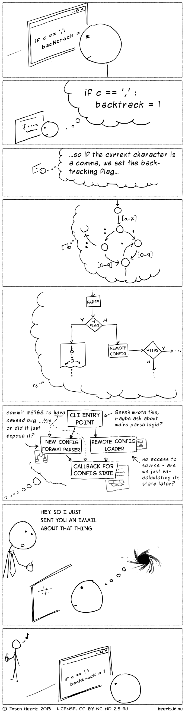

[This image](http://heeris.id.au/2013/this-is-why-you-shouldnt-interrupt-a-programmer) has been circling the Internet recently. It demonstrates the peril of interrupting a programmer deep in thought: they lose their focus and can't immediately jump back to where it was.

While this is definitely true, it is also true for every single other job that requires critical thought or analysis. Which is just about anything more complex than [ditch digging](http://www.youtube.com/watch?v=8i5OrcxwFUA).

I believe that one of the roots of the evils1 in software development right now stems from pride. The notion that you're inherently better just because you can string together a couple of while loops and use the Terminal is ridiculous.

