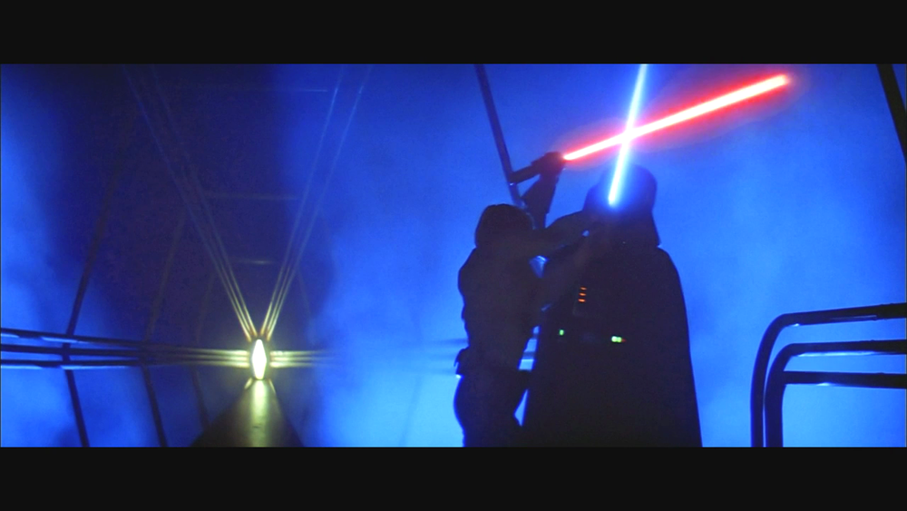
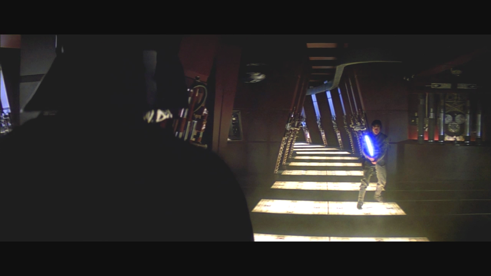
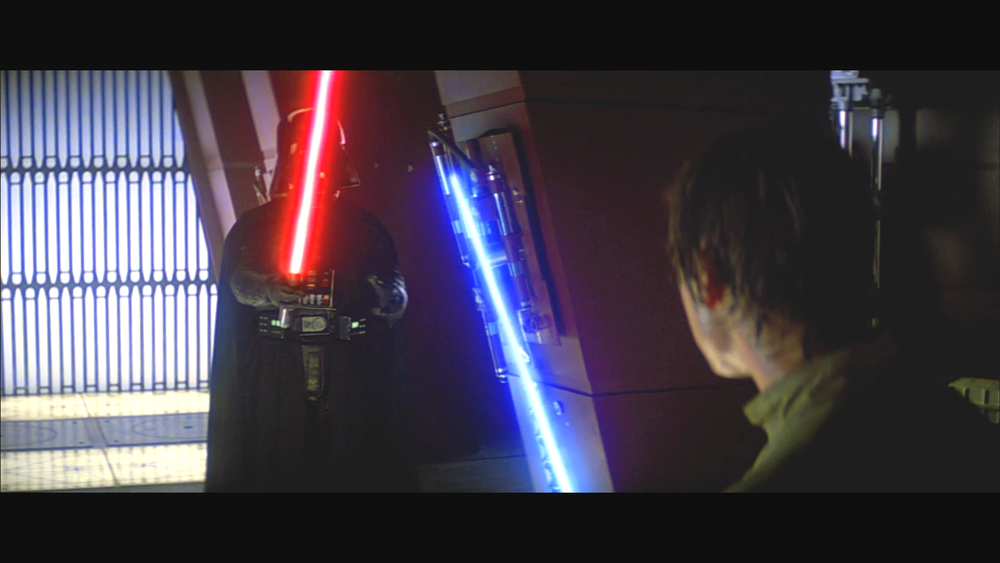
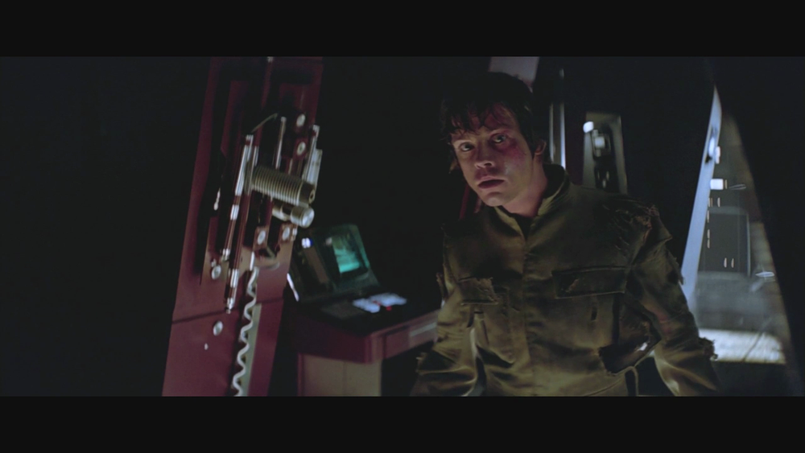
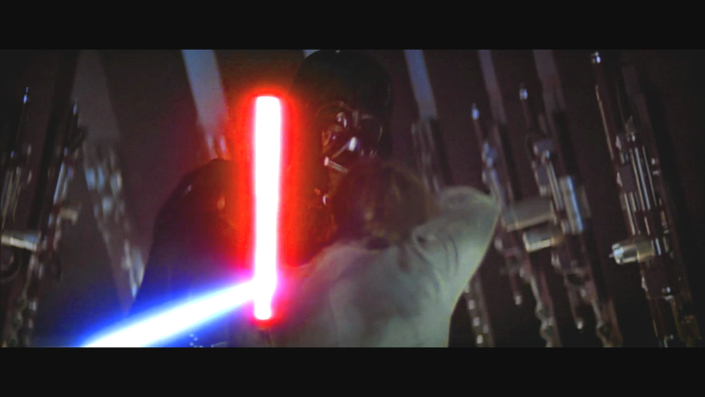
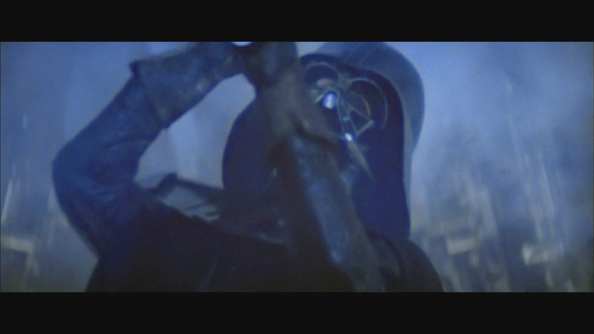
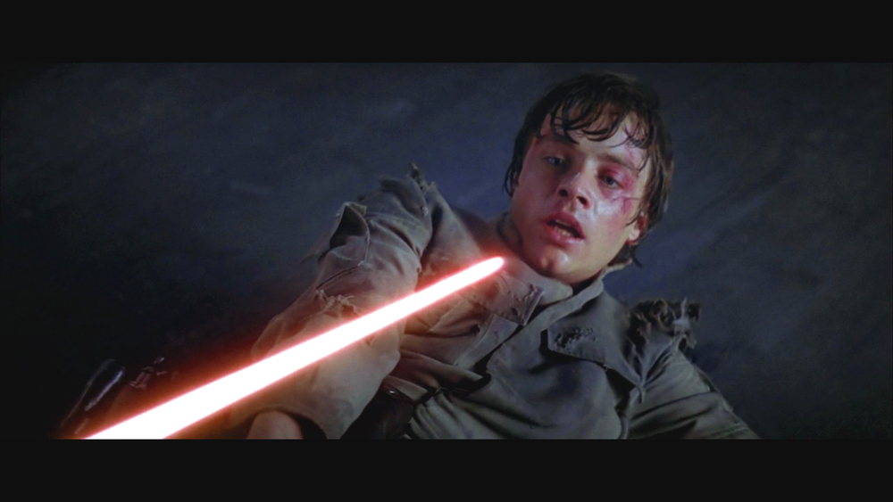
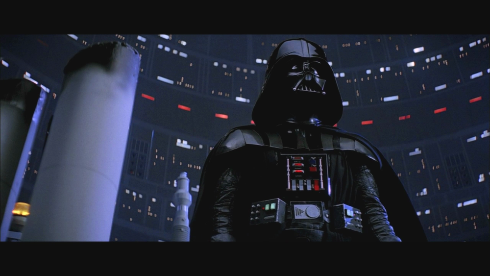

I recently watched the original Star Wars trilogy1 with my 5 year old. She's really enjoyed it and caught the bug. I've watched those movies probably 50 times each, but it was a new experience to watch it with my daughter. One of the things that I enjoyed in particular was the level of detail in Empire during Luke's duel with Darth Vader.

The lighting and framing sets the mood appropriately. This is the darkest movie, and not very many good things happen to our heroes. Vader's purpose here is twofold, first to capture Luke and take him to the Emperor, but also to see how strong he was. 

What I didn't quite notice before is that he starts the duel *one-handed*. In Episode IV he used a standard two hand grip, but here with the kid fresh out of Yoda-school he felt confident enough to just use the one. It worked pretty well for him and he disarmed Luke in short order.

Luke eventually manages to surprise Vader and knock him off a ledge, leading to the second encounter.

I love the camera angle here. Vader looms hugely in the foreground and slowly approaches Luke.

He very noticeably switches to a two-handed grip and proceeds to again show Luke exactly who is in control. At this point Luke realizes just how out-classed he is by swinging blindly around and by only luck survives and escapes.

For some reason, Luke decides to be stupid and looks for Vader again.

At this point, Vader is through messing around. He attacks viciously over and over2. Again, I <em>love</em> the camera work here. It's a little bit lower to make Vader seem even bigger than he normally is. At this point you can understand how it was this guy that killed off most of the Jedi.

Yikes.

Luke doesn't stand a chance. He's knocked down again, showing possibly my favorite part of this scene. Mark Hammill wasn't ever in danger of winning any Academy Awards, but the he nails the fear here.

Luke somehow manages to get back up and resume the fight, even scoring a graze on Vader's shoulder. Vader's had enough and with a couple quick motions cuts off Luke's hand and proceeds to the classic "I am your father" scene. Once again the camera work is great: it's from Luke's point of view staring up to a triumphant Vader.

Compare his costume to Luke's, which is now tattered. The scene ends shortly thereafter with Luke escaping.

My daughter is a bit talkative and will generally ask the types of questions a five year will ask during a movie. "Where is Princess Leia?" (just outside the frame, don't worry about it) "Why are they doing that?" (a good movie will show you why, keep watching) "What's his name again?" (Lando). But during the last bit of the fight and the reveal she just sat there and stared enrapt at the television.

That's quality film-making.

<small>
1. I managed to get <a href="http://www.amazon.com/gp/product/B001EN71DG/ref=as_li_ss_tl?ie=UTF8&amp;camp=1789&amp;creative=390957&amp;creativeASIN=B001EN71DG&amp;linkCode=as2&amp;tag=thepetzoo-20">The Theatrical Edition on DVD</a> when it was on sale at normal prices. And also the <a href="http://originaltrilogy.com/forum/topic.cfm/Harmys-STAR-WARS-Despecialized-Edition-HD-V25-MKV-IS-OUT-NOW/topic/12713/">"despecialized" version in HD too</a>, so no painfully obvious CG dinosaurs in the background for us.
</small>

<small>
2. One of the things I liked about the end of Return of the Jedi (even though it is not nearly as good) is that the fighting style was reversed when Luke nearly kills Vader. He jumps out of the shadows and overpowers his opponent with brute force quickly and decisviely before dismembering him. The camera even follows suit with Luke ultimately standing over his fallen foe. This was much more subtle and well-executed than the ham-fisted "rhyming" that the prequels did.</small>