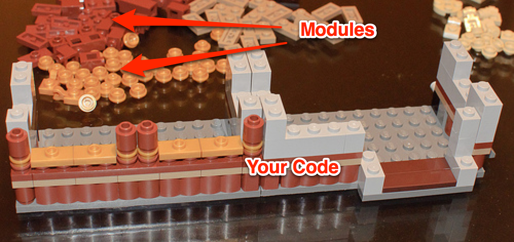

[Last time we learned about how to use modules to dynamically add functionality to a class](/words/2014/01/26/demystifying-ruby-dsls). This time let's take a look at doing that, but customizing our extensions at runtime. 

What helped me ultimately understand how these things work is that you are building up classes on the fly. It's kind of like when you `include` a module, it's editing that class to add more methods to it. Think of a bunch of Legos. Each Lego is a module with various methods on it. At runtime they assemble together to build a castle.

<figure>
    
    <figcaption><a href="http://www.flickr.com/photos/56619626@N05/7406185206/in/photolist-chsCQo-chsDcG-chsCVb-chsD97-chsBY3-chsCeN-chsDid-bgETZB-8FZGC9-9nsJ9P-8oTk1n-dCdMj4-f8b3QR-7J1LqD-7BnYDa-7BnZmZ-7BrJZw-7BrLsb-7BnVLP-9XN1mi-cnFar5-chsCy7-gC3qkX-chsCKW-chsCs1-chsCoN-aCZJqe-aCZJe4-chsCcf-chsC41-aCcgjW-aC9BwX-aCcgf3-aC9BE6-aC9BKr-aCcgUf-aCcgRw-aC9C9v-aCcgXo-chsC7J-chsBZw-a5YVbT-em9rGR-em9ru8-emfdMW-em9tEg-emfewq-emfeEm-emfdxf-emfeh9-emfdi5">Lego Castle</a> by <a href="http://www.flickr.com/photos/skinnylawyer/">InSapphoWeTrust</a> on Flickr.</figcaption>
</figure>
			
### Dynamically Adding
What if those Legos could generate even more Legos as you were building with them, and then intelligently join themselves together?

If you're familiar with Rails, you've seen that you can just declare associations within a model — `:has_many`, `:has_one`, and so on. Once you add those directives to your class, suddenly you have access to brand spanking new methods. Have you ever wondered how that worked? Let's implement a rudimentary version.

Think for a moment about `:has_many`. What would you expect the line `has_many :gerbils` methods to do?  You would have to have a `gerbils` method to retrieve the little fellas, and another one, `gerbils=(new_value)` to set them (and others to add them and so on, but [KISS](http://en.wikipedia.org/wiki/Keep_it_simple_stupid)). You implement that with a generic `get_child_models(child_name)` method, but that feels like the Java (™ Oracle Corporation) way... and I have too much self respect to go down that path. Instead we can take advantage of Ruby's metaprogramming capabilities and generate them dynamically. 

One way to do this is with `eval`.

### A Word on Eval

Ruby has a few versions of `eval`. They all take strings or blocks and turn them in code that is executed.

 * There's the [standard one](http://www.ruby-doc.org/core-2.1.0/Kernel.html#method-i-eval) that executes arbitrary code.
 * [class_eval](http://ruby-doc.org/core-2.1.0/Module.html#method-i-class_eval) — similar to vanilla `eval`, but executes the code in the context of the Class itself. There's also `module_eval` which does the same thing (more or less). Example:

``` ruby
class Monkey
end

m = Monkey.new
Monkey.class_eval %q(def screech() 'Eek Eek' end)
m.screech # Eek Eek
```
     
* [instance_eval]() — modifies a class, but from an instance point of view, *and only for that particular instance* (this is called a [Singleton method](http://rubymonk.com/learning/books/4-ruby-primer-ascent/chapters/39-ruby-s-object-model/lessons/131-singleton-methods-and-metaclasses)).

``` ruby
class Monkey
end

m = Monkey.new
m2 = Monkey.new
m.instance_eval %q(def screech() 'Eek Eek' end)
m.screech # Eek Eek
m2.screech # NoMethodError: undefined method `screech' for #<Monkey:0x007fa6f768bac8>
```
    
Using these techniques you can generate the set of methods for our `:has_many` implementation.

``` ruby
module Associations
  class << self
    def included(base)
      base.extend Associations::ClassMethods
    end
  end

  module ClassMethods
    def has_many(thingies)
      code = %(
        def #{thingies}
            # retrieve stuff from here
        end

        def #{thingies}=(new_value)
            # set new_value here
        end
      )
      class_eval code
    end
  end
end
```

Now, if you `include Associations` in your class, you can call `has_many :hamsters` or `has_many :gerbils` or `has_many :guinea_pigs` and have all of your getters and setters created.

			
			

<figure>
    
    <figcaption>This is you with all the gerbil methods.</figcaption>
</figure>


###Caution

I'm not a big fan of `eval`, at least when using it with strings. The biggest reason is that it makes bugs harder to find. The Ruby interpreter will point out syntax errors when the file loads, but a typo in an evalled string won't get caught until runtime. The longer the string, the more likely something bad will creep in there. And some of these dynamically created methods will be long. I'm talking [Lord of the Rings Extended Edition](http://www.amazon.com/gp/product/B0026L7H20/ref=as_li_ss_tl?ie=UTF8&camp=1789&creative=390957&creativeASIN=B0026L7H20&linkCode=as2&tag=thepetzoo-20) long.

Fortunately there is a better way. The eval methods also take blocks, which work pretty well in most cases. For the purposes of dynamically generating methods, I prefer using `define_method` [source](http://ruby-doc.org/core-2.1.0/Module.html#method-i-define_method). It's available on `Module` (and therefore classes too) and, just like it says on the tin, is designed to create methods on the fly and add them to a class.

``` ruby
def has_many(thingies)
  define_method thingies.to_s do
    # retrieve stuff from here
  end

  define_method "#{thingies}=" do
    # set new_value here
  end
end
```

It's kinda similar to the eval code, in fact, `define_method` passes itself along to `instance_eval`, so when all is said and done, it's merely for our convenience. But is easier to test, and will complain loudly if there's a syntax error. 

Working with actual code rather than a string makes refactoring easier too. Let's say you want to enable your users to define their own implementations of the generated rodent methods. Pulling that out into its own method is simple:

``` ruby
def add_method_without_clobbering (method_name, &method_definition)
  unless method_defined? method_name
    define_method method_name, method_definition
  end
end

def has_many(thingies)
  add_method_without_clobbering thingies.to_s do
    # retrieve stuff from here
  end

  add_method_without_clobbering "#{thingies}=" do
    # set new_value here
  end
end
```
    
That's still possible with string evals, but is easier to read in my eyes.

That'll wrap up this entry on DSLs. There's only one other big piece of the pie I'd like to cover — blocks, but you can do a whole lot without them.

One thing to keep in mind when writing DSLs is that it can be hard to follow along. Document everything, especially the esoteric parts. It might even be a good idea to diagram the path of all the `include` chain. DSLs can make client code easier to write, but usually at the expense of crazy complexity within the DSL itself.

