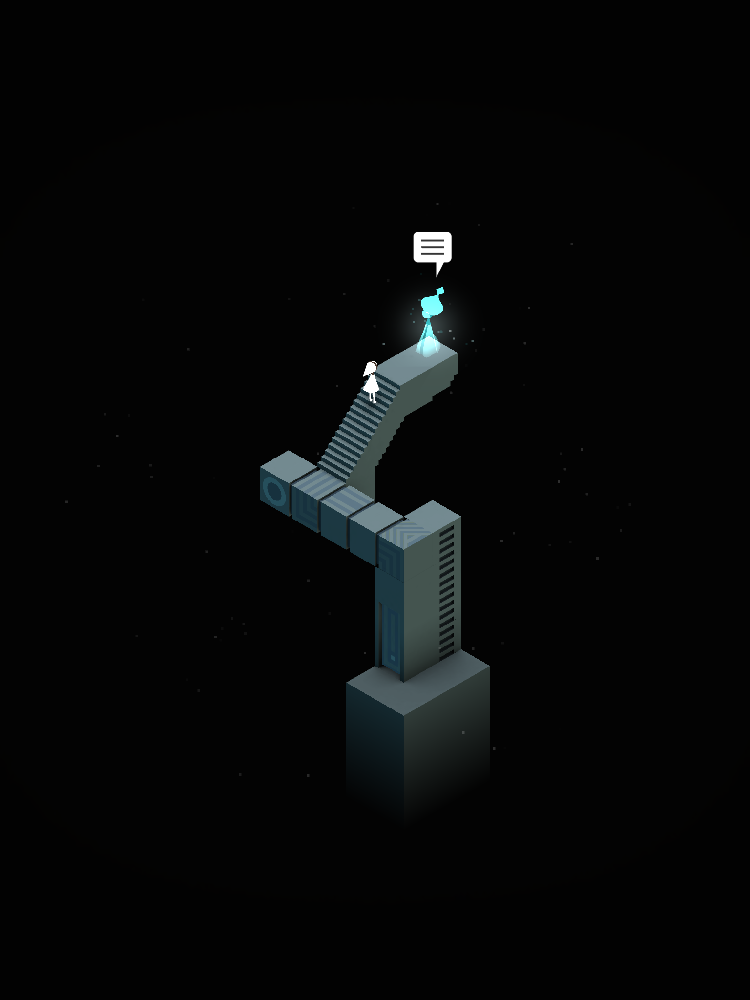
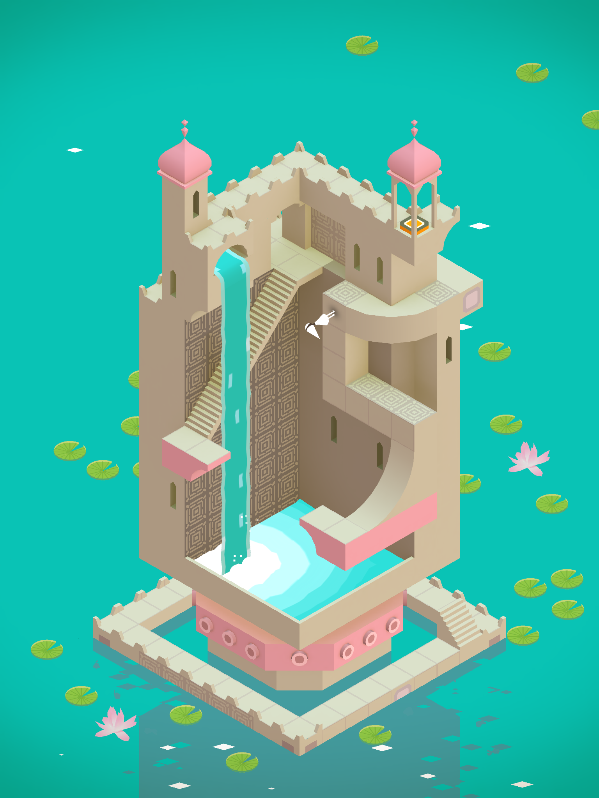
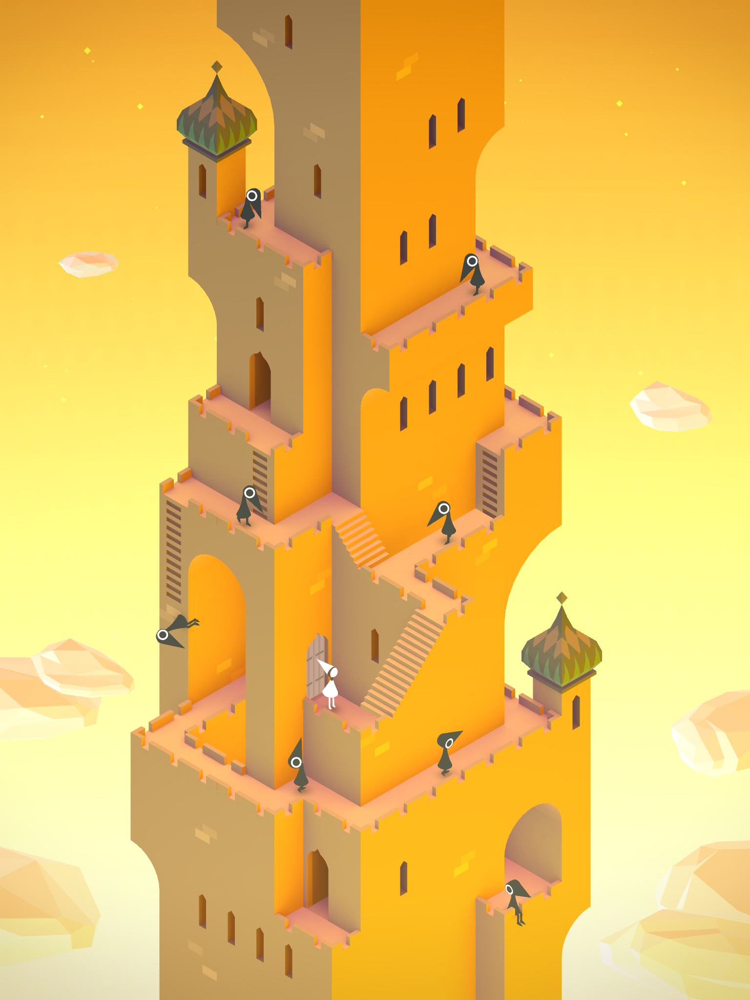
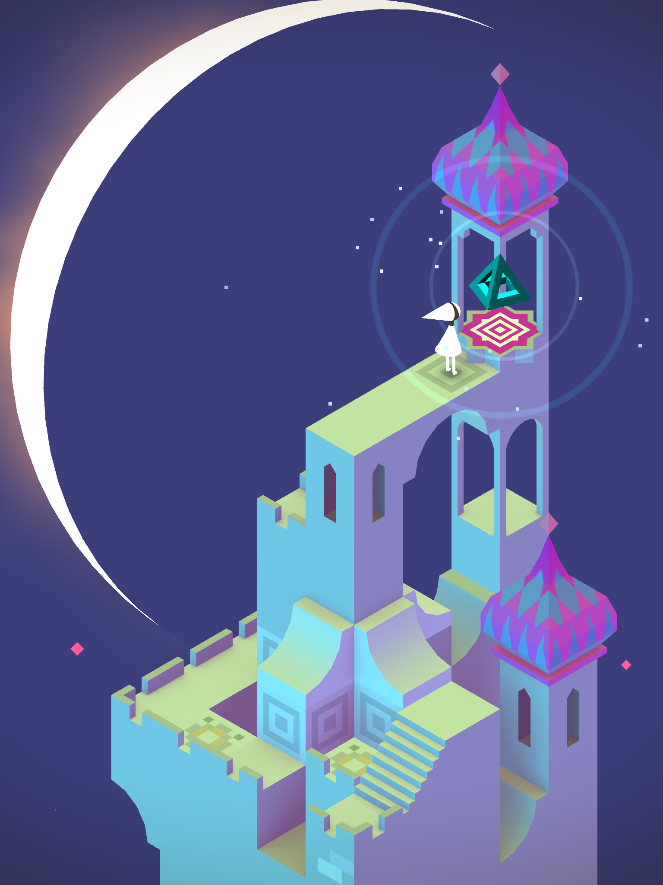
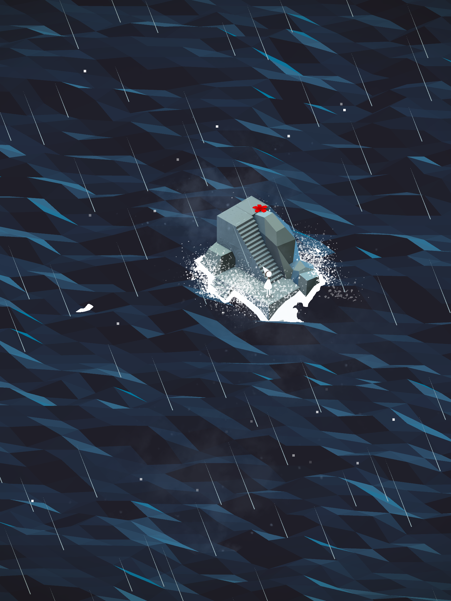
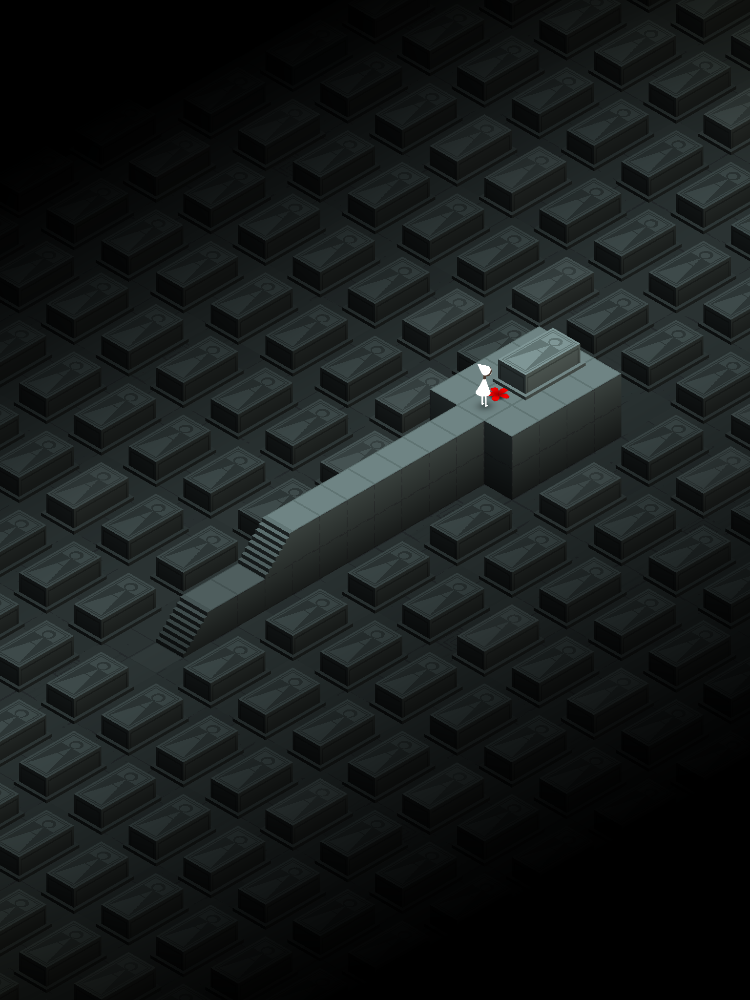

[Monument Valley](https://itunes.apple.com/us/app/monument-valley/id728293409?mt=8) is a recently released iOS game. It's received [stellar](http://www.macstories.net/reviews/monument-valley-review/) [reviews](http://www.techhive.com/article/2144770/you-should-play-monument-valley.html) for its art, and I have to agree. Just about every screen in the game is worthy of a screenshot. So much so, that I've started to use some of them as wallpapers on my phone. Here are my favorites.

    

    

    

    

    

    

For my money, it doesn't get much better than the last one.
