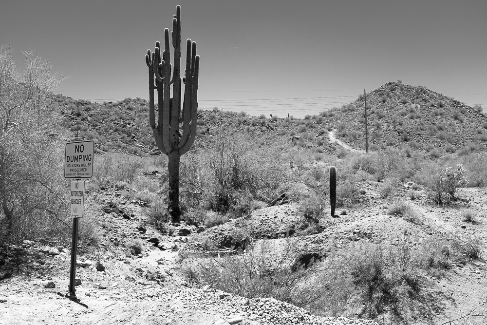

<figure>
    
    <figcaption>The Fujifilm X100s</figcaption>
</figure>

I bought a new camera a little while ago, and finally had the opportunity to put it through its paces. [The Fujifilm X100s](http://www.amazon.com/gp/product/B00ATM1MVA/ref=as_li_tl?ie=UTF8&camp=1789&creative=390957&creativeASIN=B00ATM1MVA&linkCode=as2&tag=thepetzoo-20&linkId=2PJ4FLG2K25KQBDP) isn't particularly cheap, so I saved a while to be able to afford it, but so far I'm really liking it.

I have three Nikon DSLRs and an assortment of nice lenses to go with them, so why would I want a smaller, almost Point and Shoot camera? For starters, it's much smaller. I love my Nikons, but carrying around a backpack has never been [convenient](http://blog.swilliams.me/2013/09/04/you-probably-shouldnt-buy-a-dslr/), especially when you need to take a shot fast. It can fit in a large pocket, and I have a belt-style pouch for it too. Its lens is fixed at about the equivalent of 35mm on an SLR. You'd think being stuck at a single focal length would be an issue, but it's a good size for when its use cases (informal portraits, walking around, "street" photography). Oh yeah, and the pictures that come out of it are gorgeous.

<figure>
    
    <figcaption>The Desert</figcaption>
</figure>

<figure>
    
    <figcaption>Prep for a birthday Party</figcaption>
</figure>

<figure>
    
    <figcaption>Prep for a birthday Party</figcaption>
</figure>

Where doesn't it stand up very well? When you need to get closer. When you need the absolute *best* image quality. When you need a high frame-rate of shots (sports). I wouldn't shoot a wedding with just the X100s, but it would be very useful for wandering around during the reception.

Despite those issues, this is probably my go to camera for 80% of my needs right now. If it had been available 10 years ago when I was considering a DSLR purchase, I might've gone with this instead.
