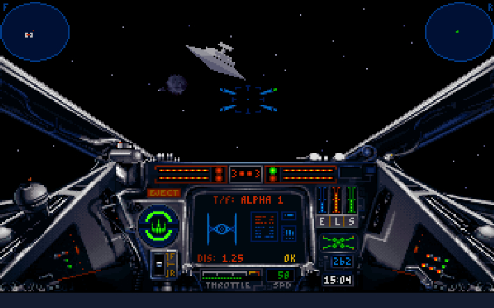

<figure>
    
    <figcaption></figcaption>
</figure>

X-Wing was one of my favorite games when I was a kid. 

I played it on my [family's rather old 386](http://blog.swilliams.me/words/2014/01/09/my-computers-through-the-ages/). It didn't have a CD-ROM drive, and didn't really have a "gaming" sound card, which meant the sounds were primarily bleeps and bloops. <a href="http://en.wikipedia.org/wiki/Doom_(1993_video_game)">Doom</a> ran if you shrank the screen size down to postage stamp dimensions. I was able to reduce the graphics quality of X-Wing enough to make it playable.

And play it I did. I didn't have a joystick, but managed to get along well enough with the mouse1. At one point I decided that I would kill every single enemy in the game that was killable. This meant hanging around after missions ended to attack the additional TIE Fighters/Bombers/Interceptors they would send after you to "encourage" you to wrap it up. It also meant attacking the [Frigates](http://starwars.wikia.com/wiki/EF76_Nebulon-B_escort_frigate) and [Star Destroyers](http://starwars.wikia.com/wiki/Star_Destroyer), usually by myself. I managed to pull it off in the first campaign but gave up shortly after that. 

At some point I realized that you could have multiple accounts in the game. And those other accounts could be your wingmen in missions. So I took my best pilot, copied it several times over, then added them back to the game so that every wingman I had was at the Top Ace level. 

TIE Fighter was also an important game for me, though by the time I got it (and a computer that would run it) I was getting ready for college and wasn't as obsessive as only a 14 year old Star Wars fanatic could be. 

[Both](http://www.gog.com/game/star_wars_xwing_special_edition) [games](http://www.gog.com/game/star_wars_tie_fighter_special_edition) are now on sale at gog.com. I don't know if I have the time to go back and try to relive the glory days, but I'm awfully tempted.

<small>
1. A friend marveled at this. "I don't know how you got through the Death Star with <em>a mouse</em>".
</small>

