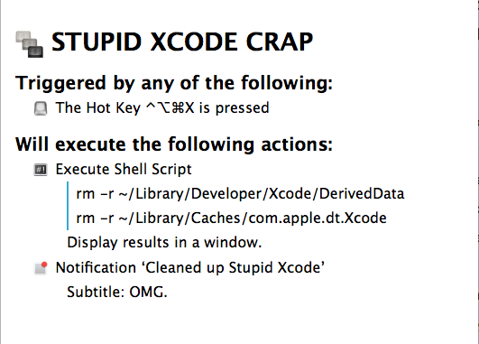

[I like Swift](http://blog.swilliams.me/words/2014/09/10/thoughts-on-swift/). But Xcode's support of Swift is... lacking (to be polite). 

My biggest woe is that code completion up and vanishes in projects. This is especially problematic when dealing with Cocoa libraries because method names tend to be verbose and descriptive. I find myself thinking "I know it's called [popToRoot-something-somthing](https://developer.apple.com/library/ios/DOCUMENTATION/UIKit/Reference/UINavigationController_Class/index.html#//apple_ref/occ/instm/UINavigationController/popToRootViewControllerAnimated:) and was it on UIViewController or the navigationController?". What would've taken two seconds of poking through code-completion to figure that out turned into a solid minute of searching documentation. Multiply this every time you can't explicitly remember every part of a method call (and spell it correctly) and tasks that normally take an hour are now a significant part of a day. 

The tools that Apple provides are now hindering development. I'm not alone in that sentiment. On Apple's developer forums (account needed to view) there are a few threads with names like ["Can SourceKit possibly crash more often on a Swift project?"](https://devforums.apple.com/message/1067119#1067119) and ["Xcode 6.1b3 Swift editing is becoming very difficult"](https://devforums.apple.com/thread/248397?start=0&tstart=0). 

One of those threads recommends deleting two folders: `~/Library/Developer/Xcode/DerivedData` and `~/Library/Caches/com.apple.dt.Xcode`. This does the job for me. It happens often enough that I created a hot key for it with [Keyboard Maestro](http://www.keyboardmaestro.com/main/).

<figure class="center">
    
    <figcaption>This will yell at you if those folders don't exist, but I can live with that.</figcaption>
</figure>

You could do something similar with [Alfred](http://www.alfredapp.com/) or any other launcher type of app.

It's kind of sad that I have to create this kind of shortcut to maintain my sanity, but I remain hopeful. If Apple is betting big on Swift (and I think they are), then they'll *have* to improve the tool support for it.