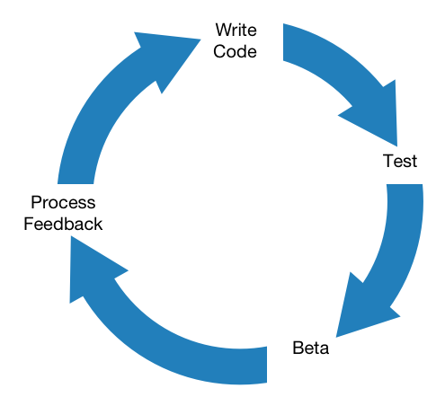

A little while ago Apple [acquired the parent company](http://techcrunch.com/2014/02/21/rumor-testflight-owner-burstly-is-being-acquired-by-apple/) of [TestFlight](http://testflightapp.com/) and began integrating its beta testing services into the iOS development ecosystem for iOS 8. Whenever there's a change to iOS there are always "gotchas"  and this was no exception: every app submitted as a beta still has to go through review.

This has been an ongoing topic on the [Upgrade podcast](http://www.relay.fm/upgrade). I recently submitted an update for [Emergency Contacts](http://blog.swilliams.me/words/2014/11/06/app-number-2-emergency-contacts/) and decided to finally check this out myself. It took about 24 hours for the beta to be approved. I voiced my concern of this to the hosts:

<blockquote class="twitter-tweet" lang="en">
.<a href="https://twitter.com/jsnell">@jsnell</a> <a href="https://twitter.com/imyke">@imyke</a> Took about 24 hours from time of uploading a build to it passing review for a TestFlight beta. Much too long in my opinion.
&mdash; Scott Williams (@swilliams) <a href="https://twitter.com/swilliams/status/530898595550339073">November 8, 2014</a></blockquote>

And got a shout out on [episode #9](http://www.relay.fm/upgrade/9) at the [25:51 mark](https://overcast.fm/podcasts/episode/244136329243311#t=1550) (edited for length):

> **Myke Hurley** — In his opinion that's too long... I hadn't thought of it that way. We'd been previously saying "Oh how great, 24 hours is perfectly fine." But, maybe you just want to get it out immediately, which is what you're used to. So 24 hours is 24 hours longer than 10 seconds.

> **Jason Snell** — You get all of the extra features of that. [HockeyApp](http://hockeyapp.net/) is still out there. The idea of Apple's TestFlight is that it's got all these other advantages going for it, including linking it to an id instead of a device id. But yeah, it'll be interesting to see how it goes and if it settles down over time. 

It's impossible to add nuance to Twitter, so I figured I could expand on my thought here. As a developer, I value this virtuous cycle:

<figure class="center">
    
</figure>

When things work properly it creates a nice feedback loop and encourages me to keep going. Taking an entire day off between one of those steps resets momentum back to 0, and at least for me, momentum is huge.

But, like Jason said, I think Apple's TestFlight offers compelling advantages, especially when compared to TestFlight's old service. The ability to upload a build right from Xcode without having to mess around with archives and symlinks is huge. I think the UI in iTunes Connect is better too. So the $64,000 question is, Whatcha Gonna Do About It?

After mulling over it for a little while I think I'll start to switch over to Apple's TestFlight. In my [consulting work](http://swilliams.me), walking clients through the UDID process was painful and fraught with peril. I'll have to educate them that their builds will take a while even though I'm "done," but that's still less of a headache than the old way.

[App review time](http://appreviewtimes.com) tends to get longer at certain intervals (new iPhones and Christmas), but picks back up as the staff works through the deluge of apps. I remain hopeful that beta review will follow suit.