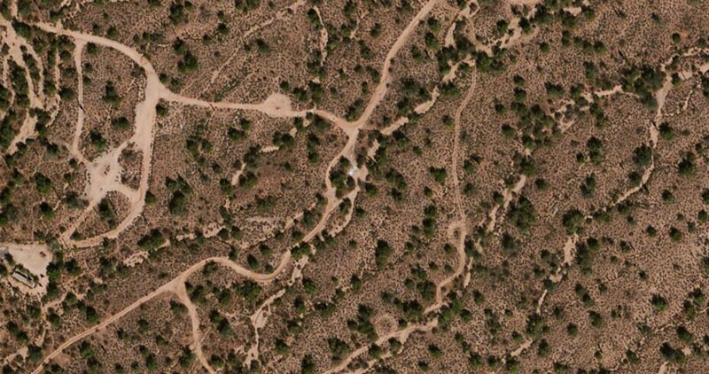
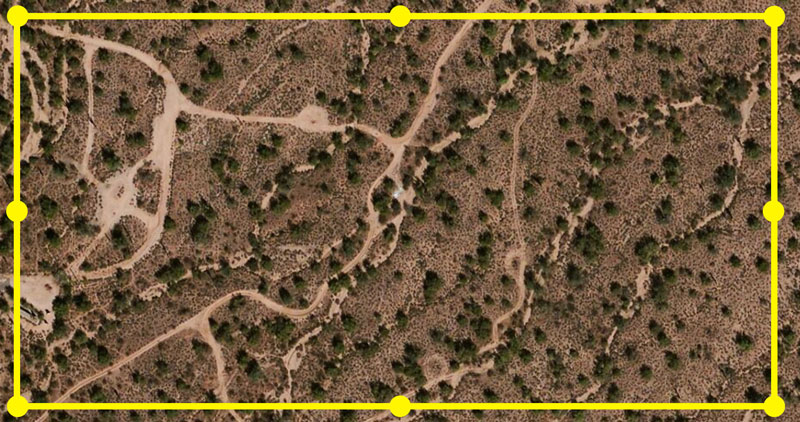
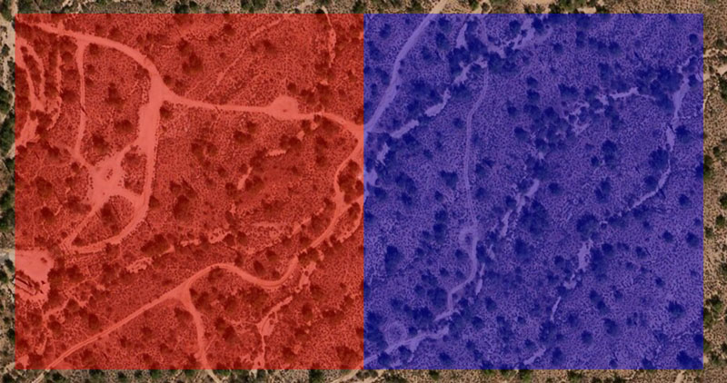
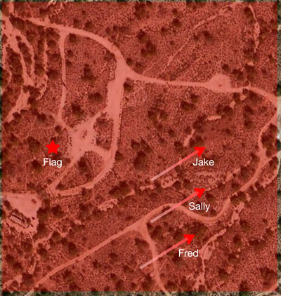

*Sometimes ideas pop into my head, and sometimes I think they're awesome. Most times though, they'd require way more time and effort to implement properly than I have available. Since I'll never get around to making this myself, I'll just share it here.*

I was playing some [Team Fortress 2](http://www.teamfortress.com/) a little while ago and enjoying myself when I had the epiphany, *you could do this in real life*. Or at least something similar<a href="#fn:1" rel="footnote">1</a>.

Modern smartphones have very accurate GPS chips inside of them, such that things like [geofencing](https://developer.apple.com/library/ios/documentation/UserExperience/Conceptual/LocationAwarenessPG/RegionMonitoring/RegionMonitoring.html) are possible<a href="#fn:2" rel="footnote">2</a>. Why not use that technology to add an additional layer of gameplay on top of things like paintball or airsoft? What if you could turn what is typically an unstructured free-for-all into a real-life tactical Capture the Flag game? Here's how I'd do it.

### Setup
The Creator creates a new game and divvies up players into teams, and assigns a Commander to each team. The Commander has special privileges (defined below).

### The Map
<figure class="center">
    
    <figcaption>Some desert</figcaption>
</figure>

Take the strip of desert that you play in. The Creator defines the boundaries for the game. If a Player strays beyond those boundaries for more than, say 10 seconds, they're penalized.

<figure>
    
    <figcaption>Drag to rearrange</figcaption>
</figure>

Next up is defining team based boundaries. 

<figure>
    
    <figcaption></figcaption>
</figure>

Each team's Commander can setup their own map dependent points of interest: a base, the Flag, etc.

### Gameplay

<figure>
    
    <figcaption></figcaption>
</figure>

The Commander can also see where each of their team members are currently located, and what directions they are going. The Commander can call out orders or instructions, set a rally point and draw directions on the map that will show up on Players devices.

For Capture the Flag, the Flag could be another kind of device like an iBeacon tied to an actual flag. When the Flag is moved it sets off alarms for its team. Moving the other team's Flag back to your base scores points for your team.

Other forms of gameplay can be defined here. If you want to have "multiple lives" the Commander can set the place you return to "regenerate". Once the game starts, these places cannot be changed.

### Communication
All communication would have to be done by some kind of bluetooth headset and microphone combination. All cues would have to be audio based to avoid having to stare at your screen all the time. Through this you'd have:

* Open communication with your team
* Alerts from the game itself ("You have left the playing field, you have 10 seconds to get back in", "Now entering Blue Space", "Your Flag has been taken", etc)
* Broadcast something to all Players ("Game ends in 10 minutes")

### After-game
When the game is over, players can view a replay and see all the movements and events from the game. This is similar to the Commander's view, but now everyone can see everything. This will let players review tactics and strategies for the next go-around.

### Considerations and Potential Issues
Phones are fragile. They won't hold up very well to paintpalls or airsoft pellets. You can route around this by keeping them in a [protective case](http://www.amazon.com/OtterBox-Defender-iPhone-Frustration-Packaging/dp/B00N1AFY1Q/ref=sr_1_2?ie=UTF8&sr=1-2&s=wireless&keywords=otterbox%2Bdefender%2Biphone%2B6&tag=thepetzoo-20&qid=1428182286) and inside a deep pocket. The headset interaction becomes key since actually pulling out a phone and looking at it would be a good way to lose focus on the action and become a nice target for the other team. Now that smart watches are becoming a thing, these could also provide something useful, but again fragility would have to be considered.

The Commander may have to use their device more often. I would assume they would be in more of a "base" or out of harm's way to allow this to happen. But hey, if General Patton was up close to enemy lines, then you can too I suppose.

Battery is also an issue. Constant GPS and Network usage will suck a battery down in no time. I think a 100% charge on a modern phone would last long enough for a couple hours, but something like a [Mophie](http://www.amazon.com/s/ref=nb_sb_noss?url=search-alias%253Daps&tag=thepetzoo-20&field-keywords=mophie) would be recommended.

Lastly, networking could be tricky, especially in remote locations. Having something covered in wifi would ease this restriction (and help battery life) but those logistics could be a bear.

### In Conclusion
As it says on the box, this is half-baked. I don't even think you'd be able to create much of a business out of it, but goshdarnit it would be fun to play. If someone actually did make something like this, I'd be all over it, and demand only a modest stake in the business. 

  <ol>
    <li class="footnote" id="fn:1">
  
If you know how to double jump in real life, I'm all ears.

</li>
<li class="footnote" id="fn:2">
  
Geofencing means that something happens when your phone enters or exits a pre-defined boundary. For example, you could have your lights automatically turn on when you get home.

</li>
  </ol>

