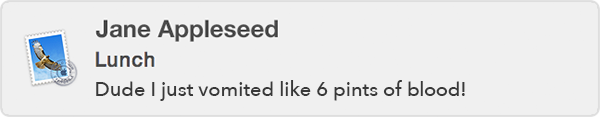
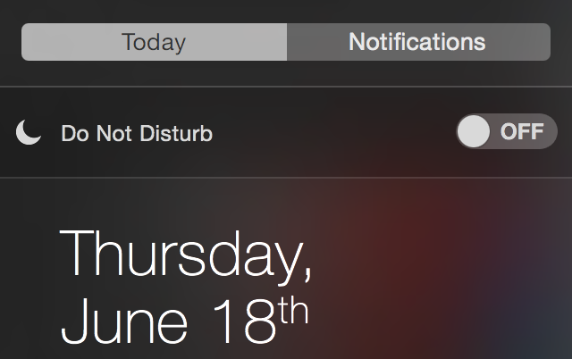

At some point in your career in technology, you're going to have to make some kind of presentation. This could be connecting your laptop to a projector, sharing your screen over some video conference, or just have people huddled around your desk. Since I care about you, I'm gonna share some advice about avoiding common pitfalls that might occur.

**Turn off notifications.** Say you're right in the middle of explaining how beautifully designed your database is to an important client, and one of your friends sends you an email.

<figure class="center">
    
    <figcaption>Oh dear.</figcaption>
</figure>

Your only options are to make an awkward joke, or ignore it completely. Hopefully Jane doesn't send any follow-ups.

On OS X you can turn off notifications by clicking the button in the top right of the menu bar, scrolling down, and then turning "Do not disturb" on.

<figure class="center">
    
</figure>

**Hide everything you aren't showing.** Again, say you're presenting something amazing to the top brass at Giant Health Conglomerate Inc. You need to switch from Keynote to a spreadsheet. You minimize Keynote and your Inbox is now in full view. What if there are some strategy emails from your CEO sitting in front of everyone? What if Jane from above has graphically described other things found in her vomit?

On OS X I like to move my presentation and ancillary windows to a [separate space](https://support.apple.com/kb/PH18757?locale=en_US). One with a very plain wallpaper.

**Use Chrome? Double check the default sites when you open a new tab.** Nothing instills confidence with a prospective client when you open a new tab and the top 8 sites you visit are right there in the open for everyone to see. "Oh, I guess you *really* like Harry Potter/Star Trek slash fiction?"

An Incognito window is a quick way to hide all that.

**Similarly, consider clearing your browser history.** Maybe you need to open up a webpage you weren't anticipating. Maybe you're checking the [redis documentation](http://redis.io/documentation), but when you type `red` into the address bar, all the subreddits you've ever visited are immediately available. Maybe you just browse [/r/aww](http://www.reddit.com/r/aww) and everyone is happy, or maybe you visit more... *unconventional*... ones.

Ultimately it's up to you how many awkward situations you want to have with your co-workers and/or clients. Try to just think about what would happen if your mother/rabbi/priest/psychologist were watching.