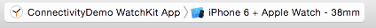

I've been noodling with an idea for a [watchOS 2](https://developer.apple.com/watchos/pre-release/) app. It involves [Connectivity](https://developer.apple.com/library/prerelease/watchos/documentation/WatchConnectivity/Reference/WatchConnectivity_framework/index.html#//apple_ref/doc/uid/TP40015269) - transferring files from the Watch to its paired iOS device. The WWDC sessions are very good, but I ran into a couple of snags with the framework. I had [tweeted something that I thought was a bug](https://twitter.com/swilliams/status/616671359557599232), but on closer inspection of the docs it actually wasn't. I [tweeted another message stating as much](https://twitter.com/swilliams/status/616673013417803776), but it hasn't gotten the notice that the original did.<a href="#fn:1" rel="footnote">1</a> Anyways, here's what I learned.

*[ed: This is with iOS 9, watchOS 2, and Xcode 7, all in beta 2. Stuff might change.]*

## You can run both simulators at once
But it's not obvious. First, run the watchOS simulator. In the scheme control, it's the "[App Name] WatchKit App" scheme, which has both the iPhone and Apple Watch available (for example, "iPhone 6 + Apple Watch - 38mm"), and run it. 

<figure class="center">
    
</figure>

When it's running, change the scheme (without stopping the simulator) to the normal iPhone scheme. In this case "[App Name] > iPhone 6". 

<figure class="center">
    
</figure>

Now, run this scheme *without* compiling: hold down ⌘ and click the Run button. The iOS app will now be running in the simulator. Sometimes the watch app will close, but you can open it back up again.

The console and breakpoints may get a little squirrelly, so you probably won't be able to depend on them so well.

## WCSessionDelegate
Connectivity has one main delegate to implement: [`WCSessionDelegate`](https://developer.apple.com/library/prerelease/watchos/documentation/WatchConnectivity/Reference/WCSessionDelegate_protocol/). This can be implemented on *both* the iOS and watchOS apps, and different behavior will happen. For example, when you transfer a file, the **receiver** will need to implement `session:didReceiveFile:`. If you want to receive some kind of notification that the file was sent the **sender** needs to implement `session:didFinishFileTransfer:error:`. 

This seemed counter-intuitive to me at first, but on further reflection, it makes sense. I do wish the docs more clearly illustrated this though.

## You're in the background
Don't forget that your iOS app is **not** guaranteed to be running when these notifications come in. And they will come in on a background queue too, so don't immediately try to update the UI without getting over to the main queue first.

## Demo
I created a simple demo app to illustrate all of this. [It's up on GitHub](https://github.com/swilliams/watchkit-connectivity-demo). Take a look at the `AppDelegate` for the iOS app, the `ExtensionDelegate` and `InterfaceController` in the watchOS extension target. This demo was thrown together quickly without regard for best practices, blah blah blah.

  <ol>
    <li class="footnote" id="fn:1">
  
Such is the nature of Twitter, alas.

</li>
  </ol>

